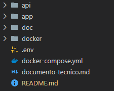
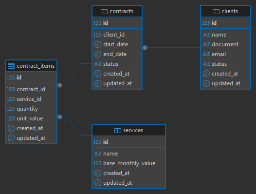
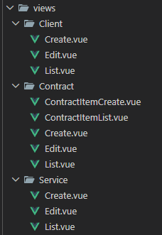

# Documentação técnica

Para desenvolver essa aplicação separei ela em dois projetos mais a estrutura do Docker.

- **api**: API RESTFull feita com PHP e Laravel.
- **app**: Front-end feito com Vue.js e Bootrstap.
- **doc:** Apenas para guardar arquivos para essa documentação.
- **docker**: Contém Dockerfile e outros arquivos necessários para montar as imagens e containers.

## API (back-end)
Escolhi utilizar Laravel por ter mais familiaridade, ter muitas funcionalidades prontas e ter uma boa documentação.  
Primeiramente, criei as migrations para montar as tabelas necessárias para o banco de dados. Após rodar as migrations foi criada a seguinte estrutura de tabelas:

Também criei seeds para popular as tabelas com dados falsos, facilitando os testes.  
Adicionei as rotas da API no arquivo `api/routes/api.php` e alterei a rota padrão do Laravel para não apontar para 
o arquivo `api/resources/views/welcome.blade.php`.  

Criei as seguintes rotas:
* Clientes
  - GET: http://localhost:8080/api/clients/1
  - GET All: http://localhost:8080/api/clients
  - POST: http://localhost:8080/api/clients
  - PUT: http://localhost:8080/api/clients/1
  - DELETE: http://localhost:8080/api/clients/1
* Serviços
  - GET: http://localhost:8080/api/services/1
  - GET All: http://localhost:8080/api/services
  - POST: http://localhost:8080/api/services
  - PUT: http://localhost:8080/api/services/1
  - DELETE: http://localhost:8080/api/services/1
* Contratos
  - GET: http://localhost:8080/api/contracts/1
  - GET All: http://localhost:8080/api/contracts
  - POST: http://localhost:8080/api/contracts
  - PUT: http://localhost:8080/api/contracts/1
  - DELETE: http://localhost:8080/api/contracts/1
* Itens do contrato
  - POST: http://localhost:8080/api/contracts/1/items
  - DELETE: http://localhost:8080/api/contracts/items/1

Para fazer alguns testes, utilizei o programa Insomnia, link para download [https://insomnia.rest/download](https://insomnia.rest/download). Caso queiram testar, vou deixar o arquivo `docs/effecti-erp-everson.yaml` com todas as rotas feitas para serem importadas para esse programa.

Criei as models para cada tabela e utilizei os relacionamentos do Laravel. Elas estão no diretório `app/Models`.  
Resolvi criar dois métodos para cada model, o método `rules()` e `errorMessage()`.
- **rules**: Regras de validação separadas por contexto, insert, update e delete.
- **errorMessage**: Mensagens de erros personalizadas para cada regra no método `rules()`.

Para cada tabela criei um service, no diretório `app/Services`. Padrão utilizado para separar as regras de negócio, removendo-as do controller, sendo um intermediário entre o controller e a model.  

Por fim, criei os controllers para cada entidade. Estão no diretório `app/Http/Controllers`. Neles são recebidas as requisições da aplicação e é feito validações, devolvendo uma responsta em JSON para a aplicação.

## APP (front-end)
Escolhi Vue.js por ser o que a empresa utiliza. Utilizei o Bootrstap para não precisar ficar escrevendo CSS e facilitar a montagem das telas.  
Criei as rotas no arquivo `app/src/router/router.js`, criei o componente `app/src/components/Header.vue` para colocar o menu de navegação e deixa-lo acessível para todas as páginas e criei os arquivos de views.

Para cada entidade criei telas de listagem, adição e edição.

### Tela de listagem
É listado em uma tabela todos os regristros cadastrados de uma entidade. Para cada linha tem ações correspondentes as regras de negócio da entidade, como edição e exclusão. E também um botão para adicionar mais um registro daquela determinada entidade.

### Tela de adição
Adiciona um novo registro. Ao clicar em salvar será validado se os campos estão corretamentes preenchidos, conforme as regras estabelecidas na model.

### Tela de edição
Mesma situação da tela de adição.

### Itens do contrato
Essa entidade é um pouco diferente, além da adição, edição, exclusão também tem uma tela para listar os itens (serviços) vinculados ao contrato.  
Ao adicionar um serviço no contrato, é feito uma requisição para a API e aplicado a regra de desconto desenvolvida. Essa regra é chamada no service `api/app/Services/ServiceService.php` ao qual chama o método `applyQuantityDiscount()` que encontra-se no arquivo `api/app/Models/ContractItem.php`.  
Na listagem e na tela de serviços vinculados ao contrato também é exibido o valor total do contrato com base nos valores dos serviços.

## Docker
Toda a configuração do docker esta no arquivo `docker-compose.yml` e na pasta `docker`.  
Ao fazer o build será criado duas imagens, uma para o front-end e outra para o back-end, ambas com suas respectivas tecnologias.

Imagens criadas:
- effecti-erp-everson-app
- effecti-erp-everson-api

Após fazer o up será criado a rede para unir os três containers.

Rede:
- effecti-erp-everson-network

Também será criado um volume para a persistência dos dados do container de banco de dados.

Volume:
- effecti-erp-everson_db-volume

E por fim será criado três containers, um para o front-end, outro back-end e outro exclusivo para o banco de dados.

Containers:
- effecti-erp-everson-app
- effecti-erp-everson-api
- effecti-erp-everson-db

## O que melhoraria com mais tempo
Se eu tivesse mais tempo poderia ter criado uma autenticação para a API. Não fiz isso, deixei todas rotas abertas, mas tenho conhecimento sobre isso, já fiz autenticação em APIs utilizando tokens simples e JWT.  
Poderia ter criado um controller para erros, evitando que o Laravel mostre a página 404 dele caso seja digitado uma URL errada.  
Também poderia ter criado as sugestões como paginação, filtros, testes e o histório de alterações.